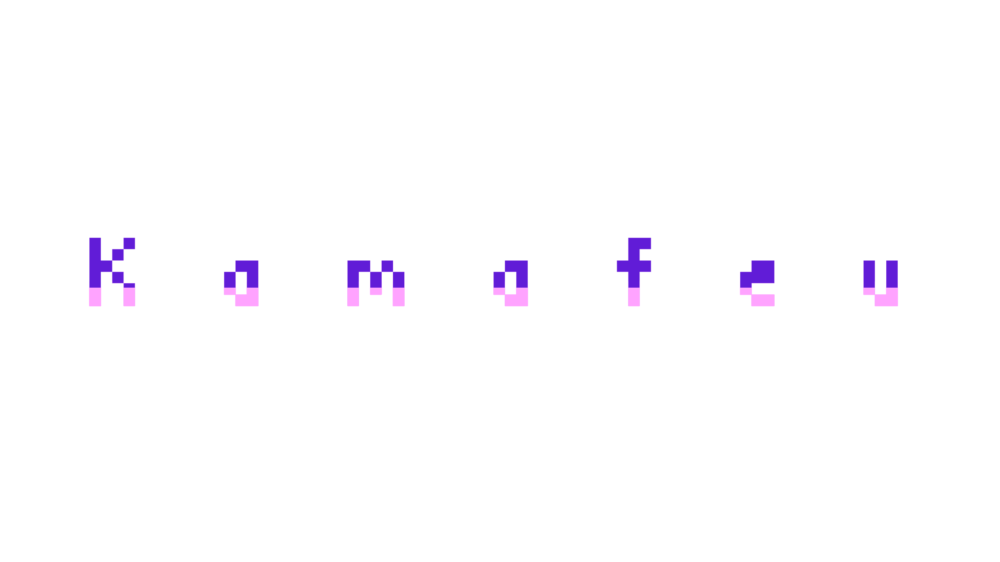
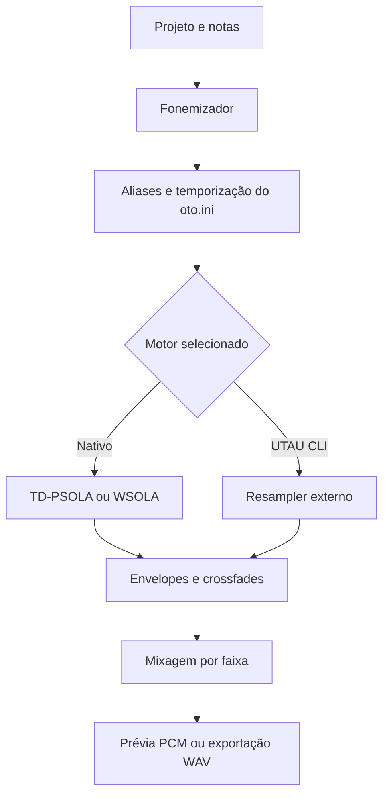

<div align="center">


# Kamafeu Studio

**Síntese vocal e piano roll em Rust, com controle sobre cada nota.**

[](CHANGELOG.md)
[](Cargo.toml)
[](LICENSE)
[](https://studiopomar.github.io/pomar-lts/)

[Downloads](https://github.com/studiopomar/kamafeu/releases) · [Primeiros passos](#primeiros-passos) · [Compilação](#compilação) · [Histórico de alterações](CHANGELOG.md)



</div>

O **Kamafeu Studio** é um editor de canto sintetizado do **Studio Pomar**. Crie melodias, ajuste letras e fonemas, desenhe curvas de afinação e trabalhe as transições entre notas usando bancos de voz do ecossistema UTAU e OpenUtau.

A síntese concatenativa parte de amostras gravadas e adapta sua altura e duração à composição. O Studio reúne edição multifaixa, reprodução e exportação de áudio, com motor nativo e integração com resamplers externos.

> **Em desenvolvimento:** a versão registrada neste checkout é `0.0.4-hotfix.1`. O formato de projeto e o motor de síntese ainda podem mudar antes da versão estável. Consulte o [changelog](CHANGELOG.md) para acompanhar as alterações.

## Navegação

- [Recursos](#recursos)
- [Filosofia e arquitetura](#filosofia-e-arquitetura)
- [Primeiros passos](#primeiros-passos)
- [Compilação](#compilação)
- [Linha de comando](#linha-de-comando)
- [Formatos suportados](#formatos-suportados)
- [Copaiba Voicebank Toolkit](#copaiba-voicebank-toolkit)
- [Motores de síntese](#motores-de-síntese)
- [Pipeline de renderização](#pipeline-de-renderização)
- [Atalhos de teclado](#atalhos-de-teclado)
- [Desenvolvimento e contribuições](#desenvolvimento-e-contribuições)
- [Glossário](#glossário)
- [Licença](#licença)

## Recursos

### Composição e interpretação vocal

- **Piano roll:** criação, seleção, movimentação, divisão e redimensionamento de notas, com copiar, colar, duplicar e desfazer/refazer.
- **Afinação expressiva:** desenho livre de pitch, suavização de curvas, rampas e vibrato, com controles de profundidade, período, fase e entrada/saída.
- **Dinâmica por nota:** envelopes de volume e propriedades de expressão acessíveis durante a edição.
- **Arranjo multifaixa:** controles de solo, mute, ganho e panorama, além de visualização da forma de onda do áudio renderizado.
- **Reprodução:** loop, prévia da seleção, metrônomo, contagem de entrada e volume master.

### Bancos de voz e fonética

- **Voicebanks UTAU:** leitura de `oto.ini` em UTF-8 e Shift-JIS, com mapeamento de tons por `prefix.map`.
- **Galeria de cantores:** busca por nome, avatares e cadastro de pastas de bancos de voz, incluindo diretórios `Singers` do OpenUtau.
- **Fonemizadores:** modos para japonês, português e inglês, incluindo conversão Romaji/Kana e variantes BRAPA, CV, VCV, CVVC e VCCV, conforme o banco escolhido.
- **Transições editáveis:** ajustes de preutterance e overlap, com visualização de crossfades em X na régua de fonemas.
- **Pacotes `.kfv`:** carregamento de bancos de voz em arquivo único e criação de pacotes pelo Copaiba Voicebank Toolkit.

### Edição de pitch, curvas e dinâmica

O pincel de pitch reúne desenho livre, linhas, suavização e vibrato. A suavização usa pontos filtrados antes de atualizar a curva, reduzindo irregularidades introduzidas pelo traço manual. As curvas guardam pontos de controle, forma de transição e portamento; em notas adjacentes, o primeiro ponto pode acompanhar a afinação da nota anterior para formar uma passagem contínua.

O editor também expõe dinâmica, volume, ataque, decaimento, velocidade de consoante, modulação, soprosidade e ajustes temporais de preutterance e overlap. Uma edição contínua de nota ou curva é gravada como uma única operação no histórico, para que desfazer e refazer respeitem o gesto completo.

### Forma de onda, ferramentas e arranjo

A forma de onda renderizada aparece no piano roll para relacionar o áudio com as notas e os limites fonéticos. Ponteiro, lápis, pitch, corte e borracha mantêm regras próprias de interação, evitando que a edição de envelope ou curva seja interpretada como arraste de nota.

O arranjo trabalha com faixas vocais e de áudio, com solo, mute, ganho e panorama. A barra de transporte reúne reprodução, parada, loop, metrônomo, prévia da seleção, tempo, grade e volume master.

## Filosofia e arquitetura

O Kamafeu prioriza controle explícito da interpretação vocal: a letra resolve fonemas, o banco de voz define os limites de cada amostra e o usuário ajusta o resultado no piano roll. O modelo interno separa projeto, faixas, partes vocais, notas, fonemização, renderização e reprodução para que importação, edição e exportação usem os mesmos dados.

```text
Projeto (.aps, USTX, UST, MIDI e outros)
        │
        ├── Faixas e partes vocais
        │       └── Notas, letras, pitch e expressões
        │
        ├── Voicebank
        │       └── oto.ini, aliases, prefix.map e amostras WAV
        │
        └── Renderizador
                ├── Fonemizador e temporização
                ├── Resampler nativo ou externo
                ├── Wavtool, envelopes e crossfades
                └── Mixagem e saída WAV/reprodução
```

O núcleo é escrito em Rust. Renderização de áudio pode usar Rayon, as amostras carregadas são mantidas em cache e a interface usa repaint condicional. O mesmo motor pode renderizar uma prévia de trecho ou exportar o projeto completo.

## Primeiros passos

Consulte os pacotes na página de [Releases](https://github.com/studiopomar/kamafeu/releases) ou [compile a partir do código-fonte](#compilação). O workflow de distribuição contempla Windows, macOS e Linux.

1. **Abra o Kamafeu Studio.** Ao executar `kamafeu` sem argumentos, a interface gráfica é iniciada.
2. **Escolha um cantor.** Na aba de voicebank, use **Abrir Galeria** ou **Outro Cantor...**. Para localizar bancos do OpenUtau, cadastre o diretório em **Gerenciar Pastas do OpenUtau / Singers**.
3. **Crie ou importe uma melodia.** Use o lápis (`N`) para inserir notas ou abra um dos [formatos suportados](#formatos-suportados) pelo menu **Arquivo**.
4. **Ajuste a interpretação.** Edite as letras, selecione o fonemizador adequado ao banco e use o pincel de pitch (`P`) para trabalhar a afinação.
5. **Ouça e refine.** Pressione `Espaço` para reproduzir ou pausar. Ajuste envelopes e transições conforme necessário.
6. **Salve e exporte.** Salve o projeto em `.aps` e use **Exportar WAV** para gerar o áudio.

O motor nativo permite começar sem instalar um resampler externo. Para sintetizar canto, carregue um banco de voz com amostras e configuração fonética compatíveis.

## Compilação

Use uma instalação atual do Rust estável com Cargo. O [manifesto](Cargo.toml) declara Rust `1.82` como versão mínima; as dependências resolvidas também precisam ser compatíveis com a toolchain utilizada.

### Dependências do sistema

- **Windows:** ferramentas de compilação C++ e Windows SDK para a toolchain MSVC.
- **macOS:** Xcode Command Line Tools (`xcode-select --install`).
- **Linux:** compilador C/C++ e bibliotecas de desenvolvimento de áudio e janela. Em Ubuntu/Debian, a CI instala:

```bash
sudo apt-get update
sudo apt-get install -y libasound2-dev libxcb-render0-dev libxcb-shape0-dev libxcb-xfixes0-dev pkg-config
```

O projeto habilita os backends X11 e Wayland no Linux.

### Compilar e executar

```bash
git clone https://github.com/studiopomar/kamafeu.git
cd kamafeu
cargo build --release --bins
```

Inicie o editor:

```bash
cargo run --release --bin kamafeu
```

Ou abra o toolkit de bancos de voz:

```bash
cargo run --release --bin copaiba
```

Os executáveis são gerados em `target/release/` (`kamafeu.exe` e `copaiba.exe` no Windows). Para desenvolvimento, execute os mesmos comandos sem `--release`.

## Linha de comando

Além da interface gráfica, o executável `kamafeu` oferece inspeção de voicebanks e renderização offline. Os exemplos abaixo usam Cargo a partir da raiz do repositório.

```bash
# Listar comandos e opções
cargo run --release --bin kamafeu -- --help

# Inspecionar um banco de voz
cargo run --release --bin kamafeu -- voicebank-info "/caminho/do/voicebank"

# Renderizar um projeto com o motor nativo
cargo run --release --bin kamafeu -- render \
  --voicebank "/caminho/do/voicebank" \
  --input "musica.aps" \
  --output "musica.wav" \
  --sample-rate 44100

# Gerar um banco de teste com amostras sintéticas
cargo run --release --bin kamafeu -- gen-sample "./voicebank-teste"
```

O comando `render` aceita `.aps`, `.ustx`, `.ust`, `.mid`, `.midi` e JSON no modelo de projeto ou lista de notas do Kamafeu. A saída é WAV PCM de 16 bits; a taxa padrão é 44.100 Hz. O banco gerado por `gen-sample` serve para testes e contém tons sintéticos.

## Formatos suportados

A tabela descreve as opções de importação e exportação da interface gráfica.

| Formato | Extensão | Importação | Exportação | Uso |
| --- | --- | :---: | :---: | --- |
| Arquivo Projeto Saturno | `.aps` | Sim | Sim | Projeto nativo do Kamafeu Studio |
| OpenUtau | `.ustx` | Sim | Sim | Intercâmbio de projetos, partes e notas |
| UTAU Sequence | `.ust` | Sim | Sim | Sequências do UTAU clássico |
| Standard MIDI | `.mid`, `.midi` | Sim | Sim | Intercâmbio de sequências musicais |
| UtaFormatix Data | `.ufdata` | Sim | Sim | Intercâmbio de dados de canto sintetizado |
| Synthesizer V | `.svp` | Sim | Sim | Conversão de dados de projeto |
| VOCALOID | `.vsqx` | Sim | Sim | Conversão de dados de sequência |
| Kamafeu Voicebank | `.kfv` | Sim | Pelo Copaiba | Banco de voz empacotado |

A conversão usa os dados representados pelo modelo interno do Kamafeu; recursos específicos de outros editores podem não ser preservados. Use `.aps` para continuar a edição no Studio e revise o resultado ao transferir projetos entre aplicativos.

## Copaiba Voicebank Toolkit

O **Copaiba** é o ambiente de preparação de bancos de voz integrado ao projeto. Ele permite calibrar amostras, editar parâmetros de `oto.ini` e empacotar cantores no formato `.kfv`. Também pode ser executado separadamente pelo binário `copaiba`.

| Parâmetro | O que controla |
| --- | --- |
| **Offset** | Início da leitura da amostra, descartando o trecho anterior. |
| **Consonant** | Região fixa do ataque que deve ser preservada durante o ajuste de duração. |
| **Cutoff** | Corte final: valores positivos removem tempo do fim; negativos definem o comprimento a partir do offset. |
| **Preutterance** | Antecipação do fonema em relação ao início da nota. |
| **Overlap** | Região usada na transição com o fonema anterior. |

Os pacotes `.kfv` reúnem os arquivos do banco e são extraídos em diretório temporário durante o carregamento.

### O que cada parâmetro do `oto.ini` muda

O **offset** descarta silêncio e ruído antes do início útil da amostra. A região de **consonant** preserva o ataque durante o ajuste de duração. O **cutoff** delimita a leitura do final do arquivo; valores negativos contam a partir do fim. **Preutterance** antecipa o ataque para que a vogal chegue ao ponto da nota, enquanto **overlap** define a região usada para conectar dois fonemas.

Na régua de fonemas, a transição é desenhada como um X: as curvas de ganho complementar mostram onde o fonema anterior sai e o próximo entra. Ao editar preutterance ou overlap, a visualização e a temporização usada pelo renderizador mudam juntas.

## Motores de síntese

### Motor nativo

O processamento de áudio é implementado em Rust, com paralelismo via Rayon e cache de amostras. O motor estima o período fundamental com YIN, constrói marcas de pitch coerentes por correlação e usa TD-PSOLA nos trechos periódicos. Material não vozeado, como consoantes fricativas e sopros, segue pelo caminho WSOLA para evitar transformar ruído em material tonal.

Ataque, sustentação e cauda recebem tratamento separado: o ataque original é preservado, a região estável pode ser estendida e a cauda é recolocada ao fim da nota. Antes do crossfade, o mixer procura o melhor alinhamento de fase entre os segmentos para reduzir cancelamentos e pulsação de volume.

### Motores externos

O Studio também executa resamplers e wavtools pela interface de linha de comando do UTAU. A busca inclui as pastas `resamplers/` e `wavtools/`, diretórios próximos ao executável e o `PATH`; os caminhos também podem ser definidos no painel do motor.

| Ferramenta presente no repositório | Função | Plataforma do binário incluído |
| --- | --- | --- |
| `macres` | Resampler | macOS Intel |
| `organum-resampler` | Resampler | macOS Apple Silicon |
| `straycat-rs` | Resampler | macOS Apple Silicon |

Os pacotes de distribuição podem incluir apenas parte dessas ferramentas. Consulte o [inventário de resamplers](resamplers/README.md) para plataformas, licenças e checksums. Para executar ferramentas Windows (`.exe`) no macOS ou Linux, a integração utiliza uma instalação local do Wine.

O arquivo `wavtools/wavtool-yawu` deste repositório é um script simplificado de cópia de áudio. Para usar os recursos do wavtool-yawu completo, configure o executável correspondente no painel do motor.

## Pipeline de renderização



Para cada nota, o fonemizador resolve aliases a partir da letra, do contexto e do banco de voz. A temporização combina os valores do `oto.ini` com velocidade de consoante e ajustes expressivos. Em prévias, o renderizador seleciona uma janela de notas suficiente para preservar o contexto nas bordas, em vez de renderizar o projeto inteiro a cada alteração.

O resultado de cada resampler pode ser reutilizado por uma chave que inclui amostra, afinação, duração e parâmetros relevantes. Depois, o wavtool nativo ou externo posiciona os trechos na linha do tempo; os envelopes e o crossfade são aplicados antes da mixagem estéreo da faixa.

### Compatibilidade UTAU e OpenUtau

O Kamafeu lê `oto.ini` em UTF-8 e Shift-JIS e reconhece `prefix.map` para bancos multitom. O importador OpenUtau preserva partes, notas, fonemizador, resampler e curvas compatíveis com o modelo interno. UST, MIDI, UtaFormatix Data, Synthesizer V e VSQX/VSQ passam pela mesma estrutura de projeto antes de serem editados ou exportados.

Os formatos não compartilham todos os recursos. Ao transferir uma música entre editores, confira as notas, expressões, curvas e fonemas no resultado importado. O `.aps` é o formato recomendado para manter a continuidade de trabalho no Kamafeu.

## Atalhos de teclado

Nas combinações abaixo, use `Ctrl` no Windows/Linux e `Cmd` no macOS. Os atalhos de edição se aplicam quando a edição de letra da nota não está ativa.

### Ferramentas

| Atalho | Ação |
| --- | --- |
| `V` ou `1` | Selecionar, mover e redimensionar notas |
| `N` ou `2` | Inserir notas com o lápis |
| `P` ou `3` | Desenhar curvas de pitch |
| `Shift + P` | Alternar subferramentas com o pincel de pitch ativo |
| `C` ou `4` | Dividir notas |
| `E` ou `5` | Apagar notas |

### Projeto, edição e reprodução

| Atalho | Ação |
| --- | --- |
| `Ctrl/Cmd + N` | Novo projeto |
| `Ctrl/Cmd + O` | Abrir projeto |
| `Ctrl/Cmd + S` | Salvar projeto |
| `Ctrl/Cmd + Shift + S` | Salvar como |
| `Ctrl/Cmd + E` | Exportar áudio WAV |
| `Espaço` | Reproduzir ou pausar |
| `Ctrl/Cmd + Z` | Desfazer |
| `Ctrl/Cmd + Shift + Z` ou `Ctrl/Cmd + Y` | Refazer |
| `Ctrl/Cmd + C`, `X`, `V` | Copiar, recortar e colar notas |
| `Ctrl/Cmd + D` | Duplicar notas selecionadas |
| `Ctrl/Cmd + A` | Selecionar todas as notas |
| `Ctrl/Cmd + Shift + A` | Limpar seleção |
| `Delete` ou `Backspace` | Excluir notas selecionadas |
| `↑` / `↓` | Transpor por semitom |
| `Shift + ↑` / `Shift + ↓` | Transpor por oitava |
| `←` / `→` | Deslocar notas em passos de 50 ms |
| `Shift + ←` / `Shift + →` | Ajustar a duração em passos de 50 ms |
| `Ctrl/Cmd + =` / `Ctrl/Cmd + -` | Aumentar ou diminuir o zoom horizontal |
| `Ctrl/Cmd + 0` | Restaurar o zoom |
| `F1` | Abrir ajuda |

## Desenvolvimento e contribuições

### Discord Rich Presence

O Kamafeu exibe o projeto, parte vocal, notas, cantor, BPM e o estado de edição, reprodução ou exportação no Discord. Para as imagens aparecerem, envie os quatro arquivos de [assets/discord](assets/discord/README.md) ao Art Assets da aplicação do Kamafeu no Discord Developer Portal. As chaves exigidas pelo aplicativo são `kamafeu_logo`, `status_edit`, `status_play` e `status_render`.

### Estrutura do repositório

```text
src/
├── audio/        # Carregamento e reprodução de áudio
├── bin/          # Executável independente do Copaiba
├── copaiba/      # Edição e empacotamento de voicebanks
├── drivers/      # Integração com resamplers e wavtools
├── dsp/          # Processamento de sinal, pitch e envelopes
├── formats/      # Leitura e escrita de formatos de projeto
├── gui/          # Interface egui, arranjo e piano roll
├── oto/          # Voicebanks, oto.ini e prefix.map
├── phonemizer/   # Conversão de letras e resolução de fonemas
├── project/      # Modelo de projeto, faixas e notas
└── renderer/     # Renderização de faixas, mixagem e exportação
resamplers/       # Resamplers externos e avisos de licença
wavtools/         # Ferramentas externas de montagem de áudio
```

### Validação

As verificações abaixo correspondem às etapas de qualidade da [CI](.github/workflows/ci.yml):

```bash
cargo fmt --all -- --check
cargo clippy --all-targets --all-features -- -D warnings
cargo test --all-targets --all-features
cargo check --release --all-targets
```

A CI também executa `cargo audit`. Para repetir essa etapa localmente:

```bash
cargo install cargo-audit --locked
cargo audit
```

Relate problemas ou proponha melhorias pelas [issues](https://github.com/studiopomar/kamafeu/issues). Ao relatar uma falha, inclua a versão do Kamafeu, o sistema operacional e os passos para reproduzi-la. Para mudanças de código, descreva o comportamento esperado e as verificações realizadas no pull request.

## Glossário

| Termo | Significado |
| --- | --- |
| **Voicebank** | Banco de amostras vocais e metadados usados na síntese. |
| **Fonemizador** | Componente que converte letras ou tokens em fonemas e seleciona aliases do banco. |
| **Pitch** | Altura musical do som; suas curvas descrevem a afinação ao longo do tempo. |
| **Síntese concatenativa** | Produção de voz pela transformação e junção de amostras gravadas. |
| **Resampler** | Ferramenta que adapta a altura e a duração de cada amostra. |
| **Wavtool** | Ferramenta que monta os trechos renderizados na linha do tempo. |
| **`oto.ini` / otoing** | Arquivo e processo de calibração dos limites e transições das amostras. |
| **Alias** | Nome fonético que aponta para uma amostra, como `ka`, `a ka` ou `- sa`. |
| **Offset** | Ponto inicial de leitura da amostra, usado para remover silêncio e ruído. |
| **Consonant** | Região consonantal preservada quando a duração da nota é adaptada. |
| **Cutoff** | Limite final da amostra; um valor negativo conta a distância até o fim do arquivo. |
| **Preutterance** | Antecipação do ataque para alinhar a vogal ao início musical da nota. |
| **Overlap** | Trecho em que dois fonemas coexistem durante um crossfade. |
| **`prefix.map`** | Mapeamento de prefixos e sufixos dos aliases conforme o tom da nota. |
| **CV, VCV, CVVC e VCCV** | Convenções de organização de aliases que descrevem a sequência de consoantes e vogais gravadas no banco. |
| **Formante** | Característica espectral do trato vocal que ajuda a definir o timbre, além da altura da nota. |
| **TD-PSOLA / WSOLA** | Técnicas de sobreposição de trechos de áudio para transformar altura ou duração. |
| **YIN** | Método de estimativa do período fundamental usado para orientar o processamento de trechos periódicos. |
| **Envelope** | Curva de ganho que controla ataque, sustentação, cauda e transição entre fonemas. |
| **GCI / alinhamento de fase** | Pontos de referência e correlação usados para reduzir cancelamento durante a sobreposição de ondas. |

## Licença

O código do Kamafeu Studio é distribuído sob a [licença MIT](LICENSE). As ferramentas externas mantêm suas próprias licenças; veja os [avisos dos resamplers](resamplers/README.md).

Desenvolvido pelo **Studio Pomar**.
