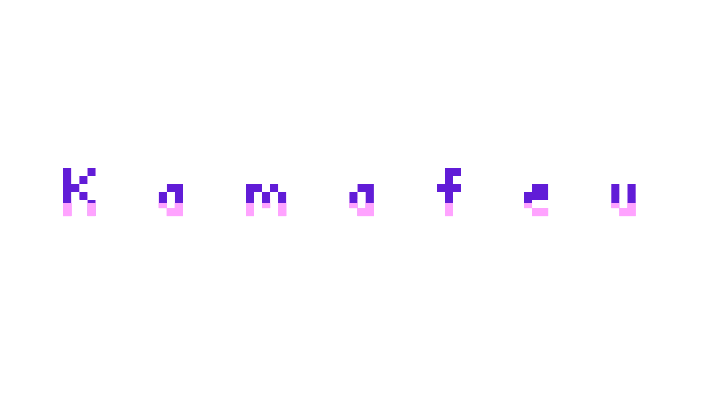
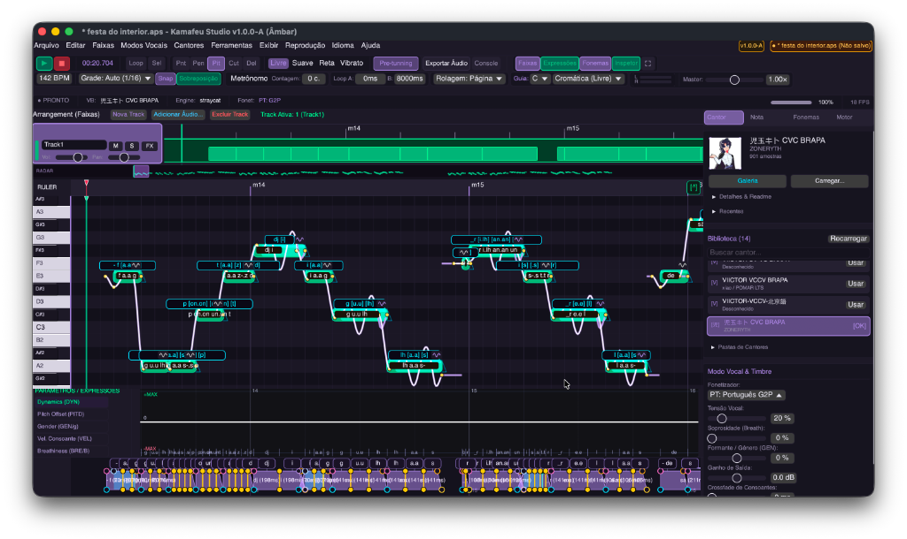
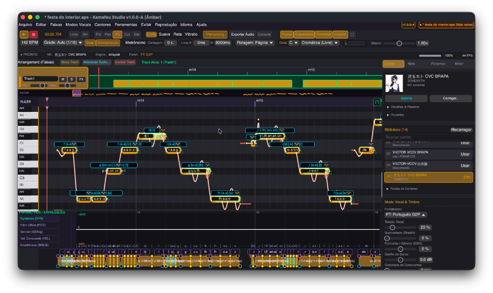
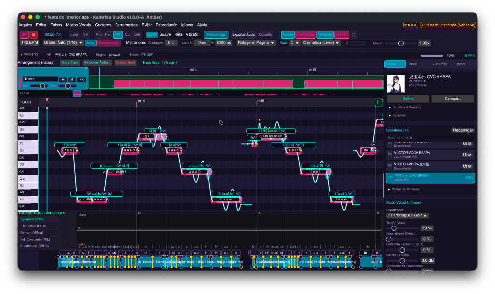
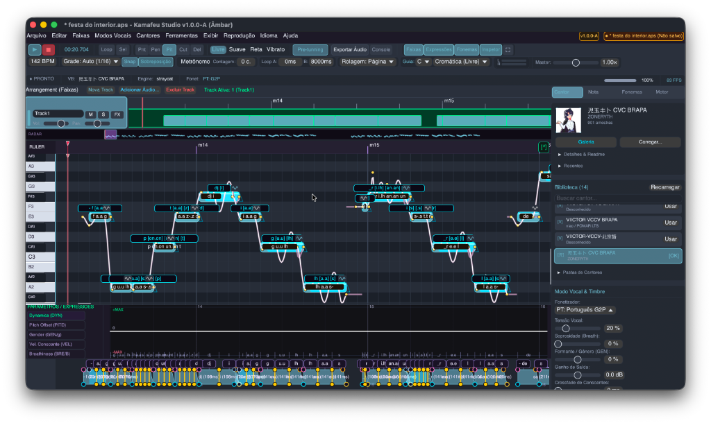
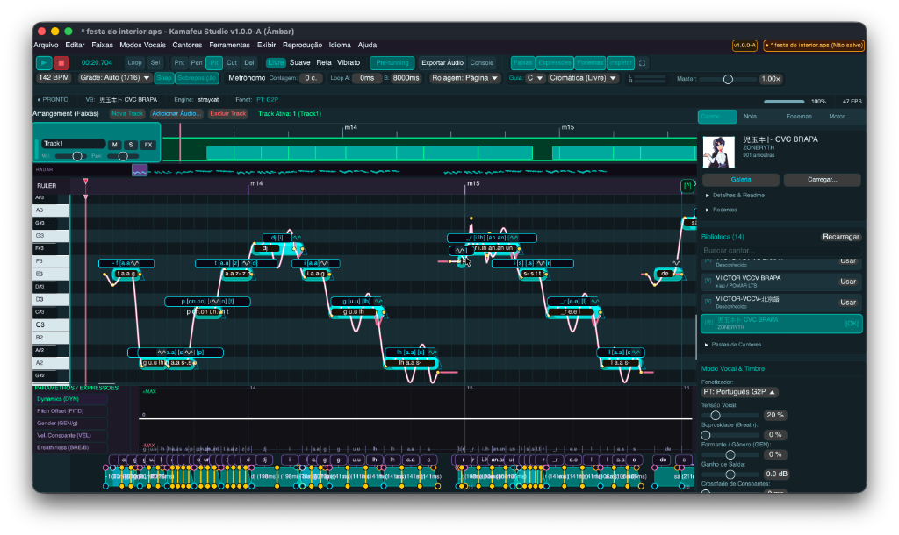

<div align="center">


# Kamafeu Studio

**Editor e sintetizador vocal baseado em amostragem e splicing (UTAU) em Rust.**

[](Cargo.toml)
[](LICENSE)
[](https://studiopomar.github.io/pomar-lts/)

**Programador:** xiao | **Direção de arte:** mori-p | **Bug reporter e QA (Linux):** makki | **Testador e QA (Windows e Linux):** zoneryth | **Testador e QA (macOS):** xiao

[Downloads](https://github.com/studiopomar/kamafeu/releases) | [Primeiros passos](#primeiros-passos) | [Compilação](#instruções-de-compilação) | [Histórico de alterações](CHANGELOG.md)

> **Estado atual:** `1.0.2-rc.1` (release candidate). O núcleo do editor e os formatos principais estão maduros; motores externos, voicebanks e drivers de áudio devem ser validados na máquina do usuário.

O formato nativo `.aps` preserva discretamente a linhagem do antigo Projeto Saturno, antecessor espiritual do Kamafeu Studio.



</div>

O **Kamafeu Studio** é um ambiente completo de composição, edição e síntese de canto voltado para o ecossistema UTAU e OpenUtau. Ele combina piano roll de alta precisão, modelagem contínua de afinação, ajustes fonéticos detalhados e pipeline de áudio multithread, com suporte a motores nativos em Rust e executáveis externos da comunidade.

O nome **Kamafeu** faz referência à tradicional joia em camafeu, esculpida manualmente em relevo. O propósito central do projeto é fornecer controle técnico direto e transparente sobre o processo clássico de amostragem, calibração (*oto.ini*), afinação e transição acústica de bancos de voz gravados. Além do pipeline UTAU, a versão desktop também reconhece bancos **DiffSinger** e executa pares acústico/vocoder ONNX compatíveis; esse caminho ainda não está disponível na compilação WASM.

## Sumário

- [Recursos do sistema](#recursos-do-sistema)
  - [Piano roll e composição melódica](#piano-roll-e-composição-melódica)
  - [Bancos de voz e suporte fonético](#bancos-de-voz-e-suporte-fonético)
  - [Processamento e efeitos (DSP)](#processamento-e-efeitos-dsp)
  - [Personalização e temas visuais](#personalização-e-temas-visuais)
- [Arquitetura e fluxo de síntese](#arquitetura-e-fluxo-de-síntese)
- [Formatos de arquivo suportados](#formatos-de-arquivo-suportados)
- [Motores de áudio](#motores-de-áudio-resamplers-e-wavtools)
  - [Motores de afinação (Resamplers)](#motores-de-afinação-resamplers)
  - [Motores de junção e emenda de fonemas (Wavtools)](#motores-de-junção-e-emenda-de-fonemas-wavtools)
- [Copaiba Voicebank Toolkit (Experimental)](#copaiba-voicebank-toolkit-experimental)
- [Primeiros passos](#primeiros-passos)
- [Instalação para usuários finais](#instalação-para-usuários-finais)
- [Versão mobile (Android; iOS em avaliação)](#versão-mobile-android-ios-em-avaliação)
- [Arquivos de configuração, cache e logs](#arquivos-de-configuração-cache-e-logs)
- [Instruções de compilação](#instruções-de-compilação)
  - [Linux](#linux)
  - [FreeBSD](#freebsd)
  - [macOS](#macos)
  - [Windows](#windows)
- [Interface de linha de comando](#interface-de-linha-de-comando)
- [Extensões](#extensões)
- [Tabela de atalhos de teclado](#tabela-de-atalhos-de-teclado)
- [Estrutura do código-fonte](#estrutura-do-código-fonte)
- [Guia detalhado dos arquivos](docs/GUIA_DO_CODIGO.md)
- [Roteiro de produto](docs/roadmap-produto.md)
- [Licença](#licença)

## Recursos do sistema

### Piano roll e composição melódica
- **Ferramentas de edição:** Ponteiro de seleção e movimentação (`V`), lápis de desenho contínuo (`N`), divisão de notas (`C`) e borracha (`E`).
- **Desenho e modelagem de afinação:** Pincel livre de pitch (`P`), glissando em linha reta, pincel gerador de vibrato e suavizador de curvas. Suporte completo a pontos de portamento e envelopes com curvas S, lineares e Bézier.
- **Suporte a escalas musicais e guia tonal:** Assistente de escalas (Maior, Menor Natural, Harmônica, Melódica, Pentatônicas, Blues, Dórico e Mixolídio) com destaque visual das notas dentro do tom e marcação da tônica.
- **Indicação visual da tonalidade:** As linhas do piano roll mudam de cor conforme a escala e a tônica escolhidas, facilitando a criação de harmonias; também é possível selecionar notas fora da escala ativa.
- **Expressões por nota:** Painel inferior retrátil para edição de dinâmica, modulação, velocidade de consoante, sopro (*breathiness*), formante de gênero (*gender*) e envelopes UTAU de amplitude em 5 pontos.
- **Navegação sincronizada:** Playhead compartilhada entre arranjo, RADAR e piano roll, com acompanhamento horizontal durante a reprodução e opção de acompanhamento vertical das notas.
- **RADAR interativo:** Mini mapa com notas e janela de viewport arrastável para navegar rapidamente por projetos longos, inclusive quando o ponteiro sai dos limites do radar.
- **Navegação por mouse e trackpad:** Scroll vertical no arranjo, `Shift + scroll` para deslocamento horizontal e suporte a gestos de dois eixos de trackpads.
- **Waveforms em camadas:** Forma de onda do áudio instrumental permanece na faixa de arranjo; a forma de onda vocal processada é exibida separadamente no rodapé do piano roll, sem interferir nas notas de outras faixas.
- **Ferramenta de repetição de loop:** Delimitação de região de repetição `[A ... B]` diretamente na régua com `Shift + Clique / Arraste`, além de controles numéricos com recomeço contínuo e sem engasgos.
- **Metrônomo sincronizado:** Síntese de cliques no andamento do projeto com acentuação tonal no primeiro tempo de cada compasso.
- **Exportação rápida de seleção:** Opção de menu e atalho de clique direito para exportar exclusivamente as notas selecionadas no formato `[Projeto] - [Voicebank] - wip.wav`.
- **Menu contextual de notas:** Ações em lote para converter aliases japoneses VCV→CV ou CV→VCV, remover caracteres não-Hiragana, limpar parâmetros, resetar tempos de fonemas e forçar a atualização fonética, com suporte a Undo/Redo.
- **Área de trabalho otimizada:** Painéis recolhíveis de arranjo multifaixa (`Alt + A`), expressões (`Tab`), fonemas (`Alt + O`), inspetor lateral (`Cmd/Ctrl + B`) e modo de tela cheia (`F11`).

### Bancos de voz e suporte fonético
- **Compatibilidade UTAU e OpenUtau:** Leitura e gravação de arquivos `oto.ini` em codificações UTF-8 e Shift-JIS com suporte a múltiplos tons via `prefix.map`.
- **Fonemizadores integrados:**
- Japonês: CV (Hiragana), VCV e CVVC com conversão automática Romaji para Kana.
- Conversão de letras japonesas: limpeza de caracteres não-Hiragana com normalização de Katakana e conversão contextual de aliases CV/VCV pelo menu da nota.
  - Português: BRAPA VCCV, CVC, CVVC e VCV, além de conversão ortográfica G2P.
  - Inglês: VCCV com suporte completo ao inventário fonético de encontros consonantais.
  - Modo manual: Inserção direta de aliases e subfonemas separados por ponto ou ponto e vírgula.
- **Régua de fonemas:** Visualização gráfica dos limites de corte, preutterance, overlap e consoante fixa diretamente abaixo do piano roll.
- **Pacotes compactados `.kfv`:** Formato do Kamafeu para distribuição de cantores virtuais com metadados e áudio empacotados.

### Processamento e efeitos (DSP)
- **Rack de efeitos integrado:** Equalizador paramétrico e gráfico de 31 bandas, compressor de dinâmica, chorus, delay de sincronismo e reverb estéreo aplicáveis por faixa.
- **Visualização de áudio otimizada:** Waveforms processadas em cache, com atualização em segundo plano e invalidação por alteração, reduzindo trabalho repetido durante edição e reprodução.
- **Alinhamento de fase e equal-power crossfade:** Junção suave entre notas adjacentes na mixagem de saída, eliminando estalos de fase e picos de distorção no somatório do buffer.
- **Auto-Pitch:** Sistema de afinação orgânica para aplicação de portamentos de entrada, quedas de final de frase e vibratos proporcionais ao andamento musical.

### Personalização e temas visuais

O Kamafeu Studio conta com um motor completo de temas e customização de interface (`Ctrl + Alt + T` / `Cmd + Alt + T`), permitindo alternar instantaneamente paletas de cores, cantos arredondados, contraste de notas e densidade de elementos:

#### Pomar Neon (Esmeralda)


#### Melodina Classico (Bariloche)


#### Cyberpunk (Synthwave)


#### Nordic Slate (Clean Dark)


#### Voz-a-loide Teal (Mikan)


## Arquitetura e fluxo de síntese

A arquitetura do Kamafeu Studio foi projetada de ponta a ponta em Rust para garantir baixa latência na interface do usuário, processamento DSP determinístico e síntese paralela de áudio.

```text
┌─────────────────────────────────────────────────────────────────────────────────┐
│                           CAMADA DE PROJETO & MODELAGEM                         │
│  Projeto (.aps, .ustx, .ust, .mid, .ufdata, .svp, .vsqx)                        │
│  ├── Faixas Vocais e Partes de Áudio (Volume, Pan, Mute, Solo)                  │
│  ├── Sequência de Notas (Posição ms, Duração ms, Notação MIDI, Sílaba / Letra)   │
│  ├── Curva Contínua de Afinação (Pontos de Portamento, Vibrato, Glissando)       │
│  └── Parâmetros de Expressão (Dinâmica, Velocity, Modulação, Sopro, Gênero)     │
└──────────────────────────────────────┬──────────────────────────────────────────┘
                                       │
                                       ▼
┌─────────────────────────────────────────────────────────────────────────────────┐
│                    CAMADA FONÉTICA & TEMPORIZAÇÃO (oto.ini)                     │
│  ├── Resolução de Fonemas: Motor Fonemizador (Japonês, Português BRAPA, Inglês)  │
│  ├── Mapeamento Multitom: prefix.map (Seleção automática da amostra por tom)    │
│  └── Calibragem Acústica: oto.ini                                               │
│      (Offset, Consonant Fixo, Cutoff, Preutterance de Ataque, Overlap de Fusão) │
└──────────────────────────────────────┬──────────────────────────────────────────┘
                                       │
                                       ▼
┌─────────────────────────────────────────────────────────────────────────────────┐
│                   PIPELINE DE RENDERIZAÇÃO & SÍNTESE DSP                        │
│  ├── Fila Concorrente (Thread Pool Rayon) & Cache de Amostras em Memória        │
│  ├── Resampler (Modulação Tonal & Estiramento Temporal):                        │
│  │   ├── VENUS (Nativo): Análise YIN, Síntese Formântica & Fase Mínima          │
│  │   └── straycat-rs / Motores Externos via UTAU CLI Protocol                    │
│  ├── Wavtool (Emenda, Splicing & Envelopamento):                                │
│  │   ├── Andromeda (Nativo): Envelopes UTAU de 5 pontos & Equal-Power Crossfade │
│  │   └── wavtool-yawu / Utilitários Externos                                    │
│  ├── Alinhamento de Fase: Redução de cancelamentos harmônicos em vogais ligadas │
│  ├── Rack de Efeitos (FX): Equalizador Gráfico 31 bandas, Compressor, Reverb     │
│  └── Barramento de Saída: Streaming progressivo (AudioPlayer) / Exportação WAV   │
└─────────────────────────────────────────────────────────────────────────────────┘
```

### Etapas do ciclo de processamento

1. **Estrutura de dados e eventos temporais:** O projeto decompõe composições em faixas e partes independentes. As notas musicais contêm posições e durações absolutas em milissegundos calculadas em função do andamento (BPM) e da métrica de compasso.
2. **Resolução fonética e particionamento silábico:** O fonemizador converte as letras digitadas em cadeias de fonemas individuais (como ataques de início de frase, transições consoante-vogal e consoantes de término). Para cada fonema, o sistema consulta a tabela `oto.ini` do cantor ativo e determina a amostra WAV correspondente de acordo com o tom da nota (`prefix.map`).
3. **Cálculo de temporização e sobreposição (*Timing Engine*):** A posição acústica de cada amostra é ajustada aplicando os valores de *preutterance* (para antecipar consoantes antes da batida musical) e *overlap* (definindo a zona de fusão com a nota precedente).
4. **Resampling e transposição tonal:** O motor de afinação (como o **VENUS** nativo ou o **straycat-rs**) isola o trecho útil de áudio delimitado por *offset* e *cutoff*, preserva a consoante fixa sem deformação temporal e estica ou comprime a vogal periódica, transpondo a frequência fundamental para acompanhar a curva contínua de pitch bend e os parâmetros de expressão.
5. **Emenda, envelopamento e splicing (*Wavtool & Mixing*):** O motor **Andromeda** aplica a curva de amplitude UTAU de 5 pontos a cada fatia e costura as amostras no buffer da faixa utilizando interpolação suave e *equal-power crossfade*.
6. **Streaming em tempo real e visualização:** O renderizador despacha tarefas em paralelo por blocos temporais (*progressive chunks*) através de um pool de threads gerenciado pelo Rayon. À medida que os blocos ficam prontos, eles são enviados diretamente para o dispositivo de áudio através de canais sincronizados sem bloqueio da interface gráfica, gerando simultaneamente a forma de onda de alta resolução exibida no fundo do piano roll.

## Formatos de arquivo suportados

O Kamafeu Studio lê e grava projetos em múltiplos formatos do ecossistema de síntese vocal:

| Formato | Extensão | Importação | Exportação | Descrição técnica |
| --- | --- | :---: | :---: | --- |
| **Arquivo de Projeto Saturno** | `.aps` | Sim | Sim | **Formato nativo do Kamafeu Studio.** Armazena em JSON estruturado todas as faixas vocais, partes de áudio WAV, curvas contínuas de pitch bend em alta resolução, envelopes de 5 pontos, configurações do FX Rack e metadados de projeto. |
| **OpenUtau Project** | `.ustx` | Sim | Sim | **Formato moderno do OpenUtau (YAML).** Preserva estrutura multifaixa, cantores atribuídos, expressões dinâmicas, curvas de afinação e parâmetros de respiração/gênero. |
| **UTAU Sequence Text** | `.ust` | Sim | Sim | **Formato clássico do UTAU.** Arquivo de texto estruturado por seções `[#0000]` contendo notas, letras, andamento (BPM), portamentos (`PBType`, `PBDst`) e envelopes de amplitude. |
| **Standard MIDI File** | `.mid`, `.midi` | Sim | Sim | **Padrão internacional MIDI.** Importa e exporta notas, tempos métricos, andamento e mensagens de pitch wheel para intercâmbio com DAWs como Reaper, FL Studio, Ableton e Logic Pro. |
| **UtaFormatix Data** | `.ufdata` | Sim | Sim | **Esquema universal de intercâmbio (JSON).** Padrão aberto criado para migração fiel de dados melódicos e temporais entre diversos sintetizadores de canto do mercado. |
| **Synthesizer V Project** | `.svp` | Sim | Sim | **Formato de projeto do Synthesizer V (Dreamtonics).** Conversão direta de trilhas melódicas, notas, letras e divisões silábicas. |
| **VOCALOID Sequence** | `.vsqx` | Sim | Sim | **Formato de sequência XML do VOCALOID (Yamaha).** Converte dados de trilhas de canto (`vocaloidStyleTrack`), notas musicais, letras e curvas de pitch bend. |
| **Kamafeu Voicebank** | `.kfv` | Sim | Sim | **Pacote de cantor do Kamafeu Studio (ZIP compactado).** Agrupa gravações de áudio WAV, arquivos `oto.ini`, `character.txt`, `prefix.map` e metadados de identificação do banco de voz. |

Os formatos `.aps`, `.ustx`, `.ust`, `.mid`/`.midi` e `.kfv` são os formatos
mais diretamente integrados ao fluxo do Kamafeu. `.ufdata`, `.svp` e `.vsqx`
possuem conversores próprios e devem ser tratados como formatos de intercâmbio:
algumas informações específicas de cada aplicativo podem não ter equivalente no
modelo interno do Kamafeu e, portanto, podem não sobreviver a uma conversão de
ida e volta.

## Motores de áudio (Resamplers e Wavtools)

O Kamafeu Studio permite alternar entre o pipeline nativo de processamento e ferramentas clássicas de linha de comando:

### Motores de afinação (Resamplers)
- **VENUS (Nativo):** Motor nativo em Rust baseado em síntese formântica pura, análise de periodicidade com YIN e reconstrução espectral de fase mínima. Preserva a inteligibilidade de consoantes rápidas sem cortes de alias e mantém a ressonância natural da voz sem artefatos anasalados.
- **straycat-rs (UtaUtaUtau):** Motor padrão recomendado para máxima compatibilidade e clareza acústica.
- **Motores externos:** Suporte transparente a executáveis da comunidade como `Hifisampler`, `macres`, `moresampler`, `world4utau`, `TIPS` e `Organum`. No Windows, esses binários rodam nativamente por se tratarem de executáveis do sistema; no macOS e Linux, rodam perfeitamente ao detectarem o Wine instalado na máquina.

### Motores de junção e emenda de fonemas (Wavtools)
- **Andromeda (Nativo):** Motor de emenda e costura de fonemas interno de alta performance escrito em Rust. Realiza cálculo de envelope de amplitude, interpolação de amostras e crossfade de potência constante (*equal-power*) diretamente na memória.
- **wavtool-yawu / wavtool clássico:** Junção e costura de fonemas via linha de comando com suporte a fluxo contínuo por frases.

## Copaiba Voicebank Toolkit (Experimental)

> **Aviso de desenvolvimento:** O Copaiba Toolkit é um utilitário em estágio experimental e não está pronto para uso em produção. Sua interface, estrutura de dados e rotinas de gravação de arquivos ainda passam por alterações frequentes.

O **Copaiba** foi projetado para calibragem, teste e organização de bancos de voz UTAU. Ele pode ser aberto como utilitário independente (`copaiba`) ou acionado a partir de qualquer fonema na régua do Kamafeu para inspeção dos parâmetros da `oto.ini`:

- **Offset:** Início útil da amostra, descartando silêncios ou ruídos mecânicos de captação.
- **Consonant (Consoante fixa):** Intervalo temporal que não sofre estiramento durante alterações de andamento.
- **Cutoff:** Ponto de término da amostra. Valores positivos cortam a partir do final do arquivo; valores negativos determinam a extensão a partir do offset.
- **Preutterance:** Antecipação do ataque consonantal em relação à batida métrica da nota.
- **Overlap:** Extensão da sobreposição suave com o fonema anterior para evitar descontinuidades.

## Primeiros passos

1. **Obtenha o executável:** Baixe a versão correspondente ao seu sistema operacional na aba de [Releases](https://github.com/studiopomar/kamafeu/releases) ou realize a compilação local.
2. **Carregue um banco de voz:** Abra a aba de cantores no painel lateral e selecione uma pasta de voicebank contendo arquivos `.wav` e `oto.ini`.
3. **Crie ou importe sequências:** Desenhe notas com o lápis (`N`) ou importe projetos `.ustx`, `.ust` ou `.mid` pelo menu **Arquivo**.
4. **Configure a fonética:** Selecione o fonemizador apropriado no menu **Modos Vocais** ou insira aliases manualmente nas notas.
5. **Modele a afinação:** Utilize a ferramenta de pitch (`P`) para criar curvas de transição, portamentos e vibratos.
6. **Reproduza e exporte:** Pressione `Espaço` para ouvir a prévia e utilize o menu **Arquivo -> Exportar Áudio** para gerar o arquivo final em WAV ou FLAC.

## Instalação para usuários finais

Os pacotes oficiais são publicados na página de [Releases](https://github.com/studiopomar/kamafeu/releases).
Cada pacote inclui o editor, o Copaiba e os resamplers externos compilados para a
plataforma correspondente.

### Windows

1. Baixe o pacote `windows-x64` ou `windows-x86`.
2. Extraia o `.zip` para uma pasta de sua preferência.
3. Execute `kamafeu.exe`.

O Windows x64 é a opção recomendada. O pacote não possui instalador tradicional;
o programa pode ser executado diretamente da pasta extraída.

### macOS

1. Baixe o pacote `macos-arm64` para Apple Silicon ou `macos-intel` para Macs Intel.
2. Abra o `.dmg` e execute `Kamafeu.app`.
3. Caso o macOS exiba um aviso de segurança, autorize o aplicativo em **Ajustes do Sistema -> Privacidade e Segurança**.

Os artefatos podem não estar assinados ou notarizados, dependendo da release.

### Linux

1. Baixe o pacote `linux-x64`.
2. Extraia o `.tar.gz`.
3. Execute `./kamafeu` a partir da pasta extraída.

O pacote é distribuído como binário portátil, mas ainda depende das bibliotecas
gráficas e de áudio indicadas na seção de compilação. Para resamplers Windows,
instale o Wine antes de abrir o projeto.

### Android

1. Baixe o APK Android ARM64 quando ele estiver anexado à release.
2. Autorize a instalação de aplicativos externos, se necessário.
3. Instale o APK e conceda acesso aos arquivos quando solicitado.

O APK é experimental. No Android, use preferencialmente os motores nativos VENUS
e Andromeda; resamplers externos e executáveis Windows não são suportados.

### iOS

Não há pacote oficial para iOS nesta release. A seção de requisitos usa iOS 15.1
apenas como referência de compatibilidade de aplicativos modernos.

## Dependências em tempo de execução

Além do executável, o uso completo pode depender de recursos do sistema:

- **Windows:** dispositivo de áudio funcional e drivers atualizados. Resamplers `.exe` funcionam nativamente.
- **macOS:** CoreAudio e permissões de áudio/arquivos do sistema. Wine é necessário para resamplers Windows.
- **Linux:** ALSA, X11 ou Wayland e as bibliotecas gráficas da distribuição. Wine é necessário para resamplers Windows.
- **Android:** armazenamento acessível pelo seletor de arquivos do sistema e driver gráfico compatível. O armazenamento é controlado pelo sandbox do Android.
- **iOS:** ainda sem build oficial; não há dependências de execução definidas.

O Kamafeu não instala automaticamente voicebanks de terceiros. Os arquivos WAV,
`oto.ini`, `character.txt` e, quando aplicável, `prefix.map` devem ser fornecidos
pelo usuário.

## Arquivos de configuração, cache e logs

O aplicativo armazena preferências, últimos projetos e últimos voicebanks usados
em `kamafeu_config.json`. Nas builds nativas atuais, o caminho padrão é
`$HOME/.config/kamafeu/kamafeu_config.json`; se a variável `HOME` não estiver
disponível, o arquivo é criado como `kamafeu_config.json` no diretório atual.
O caminho do cache de resamplers é `$HOME/.cache/kamafeu/resampler-v<versão>` no
Linux/Windows e `$HOME/Library/Caches/kamafeu/resampler-v<versão>` no macOS, e pode
ser alterado pelas preferências do aplicativo.

O cache contém dados temporários de renderização e pode ser removido para
diagnóstico ou para liberar espaço. Remover o cache não apaga projetos nem
voicebanks. Para investigar falhas, use a janela **Console** do editor e inclua o
log de renderização ao abrir um issue.

Projetos recentes e voicebanks recentes são apenas referências de caminho; mover
ou renomear esses arquivos pode exigir que sejam selecionados novamente no editor.

Com autosave ativado, projetos com alterações pendentes recebem cópias APS
recuperáveis no intervalo configurado (30–600 segundos). Para um projeto salvo,
elas ficam em `.kamafeu_snapshots` ao lado do arquivo; para um projeto ainda sem
nome, ficam na pasta atual. Em **Arquivo → Recuperar Snapshot...**, escolha uma
cópia por data e tamanho. Ela abre de forma segura como um projeto novo: use
**Salvar Como** para preservar a recuperação sem substituir o snapshot. Esse
mecanismo funciona nas versões desktop; a edição Web não grava snapshots locais.

## Versão mobile (Android; iOS em avaliação)

O Kamafeu Studio conta com infraestrutura baseada em `winit` e `egui`, permitindo a compilação para Android. O suporte a iOS permanece em avaliação e não faz parte dos artefatos oficiais desta release candidate. O ecossistema mobile impõe desafios arquiteturais e restrições técnicas significativas:

### Desafios de adaptação e build

1. **Impossibilidade de executar resamplers externos (Subprocessos CLI):**
   - Nos sistemas operacionais desktop (Windows, macOS, Linux), o Kamafeu pode invocar executáveis externos como `straycat-rs.exe` ou `hifisampler` através de processos filhos (`std::process::Command`) e Wine.
   - No Android e iOS, o isolamento rigoroso de processos (*sandbox*) e as políticas de segurança das lojas proíbem a criação de processos filhos arbitrários e a execução de binários Win32/x86.
   - **Solução no Kamafeu:** Dispositivos móveis dependem 100% dos motores nativos (**VENUS** para modulação de pitch e **Andromeda** para emenda e junção de fatias), que rodam diretamente linkados na mesma memória do aplicativo.

2. **Sistema de arquivos e permissões de armazenamento (*Scoped Storage*):**
   - No Android moderno (API 30+) e iOS, o acesso direto a caminhos tradicionais como `/sdcard/` ou pastas compartilhadas é bloqueado. O carregamento de voicebanks e projetos exige integração com *Storage Access Framework* (SAF) ou empacotamento prévio em arquivos `.kfv` / `.zip`.

3. **Adaptação de interface para toque (*Touch & Gesture Input*):**
   - O piano roll e a régua do UTAU foram historicamente projetados para cursor de mouse com precisão de pixel, botões secundários (clique direito) e atalhos de teclado.
   - A adaptação mobile exige zonas de toque ampliadas, gestos de pinça (*pinch-to-zoom*) para navegação temporal e vertical, e diálogos contextuais sensíveis ao toque.

4. **Gerenciamento de memória e limites de CPU:**
   - Em dispositivos móveis, a renderização multithread com Rayon precisa respeitar limites térmicos e de consumo de bateria, exigindo particionamento adaptativo de blocos de áudio e buffers menores de baixa latência (via AAudio/OpenSL ES no Android e CoreAudio no iOS).

### Compilação para Android

A compilação do APK do Kamafeu utiliza a ferramenta `cargo-apk` e o Android NDK:

```bash
# Compilar APK em modo release para arquitetura ARM64
cargo apk build --lib --release --target aarch64-linux-android
```

Os binários Android não são publicados pelo workflow desktop; a assinatura exige um keystore configurado conforme [docs/android-signing.md](docs/android-signing.md).

Para instruções detalhadas sobre assinatura criptográfica de APKs e variáveis de ambiente de keystore, consulte [docs/android-signing.md](docs/android-signing.md).

## Especificações técnicas

O Kamafeu Studio é um aplicativo nativo relativamente leve. Os requisitos abaixo são
referências práticas para executar o editor; voicebanks grandes, muitos tracks,
efeitos e renderizações simultâneas podem exigir mais recursos.

| Plataforma | Requisito mínimo | Requisito recomendado |
|---|---|---|
| **Windows** | Windows 10/11, CPU dual-core, 2 GB de RAM, 500 MB livres e GPU integrada compatível com a renderização gráfica do sistema | Windows 10/11 64-bit, CPU quad-core, 8 GB de RAM, 1 GB livre e GPU integrada moderna |
| **macOS** | macOS compatível com Intel ou Apple Silicon, CPU dual-core, 2 GB de RAM e 500 MB livres | macOS atualizado, Apple Silicon ou Intel quad-core, 8 GB de RAM e 1 GB livre |
| **Linux** | Distribuição 64-bit com X11 ou Wayland, ALSA, CPU dual-core, 2 GB de RAM e 500 MB livres | Distribuição 64-bit atual, CPU quad-core, 8 GB de RAM, ALSA e 1 GB livre |
| **Android** | Android 5.0/API 21 ou superior, CPU ARM, 3 GB de RAM e 500 MB livres | Android 10/API 29 ou superior, ARM64, 4 GB ou mais de RAM e 1 GB livre |
| **iOS** | Referência: iOS 15.1 ou superior, aproximadamente 2 GB de RAM e 500 MB livres | iOS atualizado, aparelho com 4 GB ou mais de RAM e 1 GB livre |

### Arquiteturas e artefatos

- **Windows:** `x86_64-pc-windows-msvc` (x64) e `i686-pc-windows-msvc` (x86).
- **macOS:** `x86_64-apple-darwin` (Intel) e `aarch64-apple-darwin` (Apple Silicon).
- **Linux:** `x86_64-unknown-linux-gnu`.
- **Android:** `aarch64-linux-android` (ARM64) no APK distribuído; o pipeline também contempla ARMv7.
- **iOS:** nenhum artefato oficial nesta release.

O suporte a iOS ainda está em avaliação e não faz parte dos artefatos oficiais
desta release. A versão iOS 15.1 é usada apenas como referência de compatibilidade
com aplicativos atuais, como o WhatsApp, e não significa que exista uma versão iOS
publicada do Kamafeu Studio.

Os valores de memória são estimativas operacionais, pois o projeto não impõe um
limite mínimo de RAM. O espaço indicado não inclui voicebanks, projetos, cache e
arquivos temporários do usuário.

## Instruções de compilação

Requisitos básicos: **Rust 1.82 ou superior** e ferramenta **Cargo** instalados via [rustup.rs](https://rustup.rs/).

### Linux

Instale o compilador C, o gerenciador de pacotes `pkg-config`, os cabeçalhos do ALSA para áudio e as bibliotecas gráficas do X11/Wayland:

#### Ubuntu / Debian / Linux Mint / Pop!_OS
```bash
sudo apt-get update
sudo apt-get install -y \
  build-essential \
  pkg-config \
  libasound2-dev \
  libxcb-render0-dev \
  libxcb-shape0-dev \
  libxcb-xfixes0-dev \
  libxkbcommon-dev \
  libfontconfig1-dev
```

#### Fedora / RHEL
```bash
sudo dnf install -y \
  gcc \
  pkg-config \
  alsa-lib-devel \
  libxcb-devel \
  libxkbcommon-devel \
  fontconfig-devel
```

#### Arch Linux / Manjaro
```bash
sudo pacman -S --needed \
  base-devel \
  pkgconf \
  alsa-lib \
  libxcb \
  libxkbcommon \
  fontconfig
```

### FreeBSD

No FreeBSD, instale o compilador LLVM/Clang, `pkgconf` e as bibliotecas do sistema gráfico X11 e ALSA:

```sh
sudo pkg install -y \
  rust \
  pkgconf \
  alsa-lib \
  libxcb \
  libxkbcommon \
  fontconfig
```

> **Nota:** Para habilitar a saída de áudio com compatibilidade ALSA no FreeBSD, certifique-se de que o pacote `alsa-plugins` esteja configurado ou utilize a camada de emulação de áudio OSS/sndio suportada pelo sistema.

### macOS

No macOS (Apple Silicon M1/M2/M3/M4 ou Intel x86_64), são necessárias apenas as ferramentas de linha de comando do Xcode (o backend gráfico Metal/Cocoa e o subsistema CoreAudio são nativos):

```bash
# Instalar ferramentas de compilação da Apple
xcode-select --install
```

### Windows

No Windows 10/11, utilize a cadeia de ferramentas MSVC recomendada pelo Rust:

1. Baixe e instale o [Visual Studio Build Tools](https://visualstudio.microsoft.com/visual-cpp-build-tools/).
2. No instalador, marque a carga de trabalho **Desenvolvimento para Desktop com C++** (*Desktop development with C++*) e conclua a instalação dos componentes Windows 10/11 SDK.
3. Certifique-se de que o Rust esteja configurado para a toolchain MSVC:
   ```cmd
   rustup default stable-x86_64-pc-windows-msvc
   ```

---

### Compilação dos binários

Clone o repositório e compile todos os executáveis em modo otimizado (*release*):

```bash
git clone https://github.com/studiopomar/kamafeu.git
cd kamafeu
cargo build --release --bins
```

Os executáveis gerados estarão localizados em `target/release/`:
- `kamafeu` (ou `kamafeu.exe` no Windows): Editor principal e sintetizador multifaixa.
- `copaiba` (ou `copaiba.exe` no Windows): Utilitário de calibração de voicebanks (`oto.ini`).

### Limitações conhecidas da RC

- O aplicativo não instala automaticamente resamplers de terceiros. O pacote oficial inclui apenas os motores externos cuja compilação foi concluída no workflow; outros executáveis devem ser instalados pelo usuário.
- No macOS, o artefato é um `Kamafeu.app` dentro do `.dmg`, mas assinatura e notarização dependem do processo de distribuição do mantenedor.
- A qualidade final depende do `oto.ini`, dos WAVs e do resampler/wavtool escolhidos. Um voicebank com aliases ausentes pode exigir correção manual no Copaiba.
- A reprodução com motores externos no Linux/macOS pode exigir Wine e bibliotecas de áudio/gráficas do sistema.
- Projetos importados de `.ufdata`, `.svp` e `.vsqx` podem perder recursos específicos do formato original durante a conversão.
- Voicebanks muito grandes, renderização de várias faixas e uso simultâneo de efeitos podem exceder o limite prático de 2 GB de RAM.
- No Android, o sandbox impede a execução de resamplers externos e o acesso direto a caminhos tradicionais como `/sdcard/`; use o seletor de arquivos ou pacotes `.kfv`/`.zip`.
- A interface mobile ainda está em adaptação para toque; mouse, teclado físico e telas maiores oferecem a experiência mais completa.
- Falhas de áudio podem depender do driver, do dispositivo selecionado, do backend do sistema ou da configuração do Wine.
- FreeBSD possui instruções de compilação experimentais, mas não possui artefato oficial no workflow de releases.

### Checklist rápido para reportar problemas

Inclua sempre a versão exibida na janela, sistema operacional, resampler, wavtool, voicebank, alias problemático e um projeto mínimo que reproduza o defeito. Para problemas de transição, envie também o WAV renderizado e informe se o cache foi limpo.

Para executar diretamente:

```bash
# Executar o editor Kamafeu
cargo run --release --bin kamafeu

# Executar o utilitário Copaiba
cargo run --release --bin copaiba
```

## Interface de linha de comando

O Kamafeu Studio disponibiliza comandos via terminal para tarefas em lote e checagem de arquivos:

```bash
# Exibir lista completa de comandos
cargo run --release --bin kamafeu -- --help

# Inspecionar dados e integridade de um banco de voz
cargo run --release --bin kamafeu -- voicebank-info "/caminho/do/voicebank"

# Listar bancos UTAU, OpenUTAU e DiffSinger nas pastas padrão do sistema
cargo run --release --bin kamafeu -- voicebanks

# Ou apontar uma ou mais bibliotecas de cantores explicitamente
cargo run --release --bin kamafeu -- voicebanks --path "/musica/Cantores" --path "/outros/Cantores"

# Validar WAVs e tempos do oto.ini; retorna erro se houver problemas
cargo run --release --bin kamafeu -- validate-voicebank "/caminho/do/voicebank"

# Para DiffSinger, carregar os dois ONNX e conferir o contrato do modelo
cargo run --release --bin kamafeu -- validate-voicebank --verify-runtime "/caminho/do/diffsinger"

# Conferir as faixas, notas e duração de qualquer projeto suportado
cargo run --release --bin kamafeu -- project-info "musica.svp"

# Encontrar problemas estruturais antes de renderizar ou enviar um projeto
cargo run --release --bin kamafeu -- validate-project "musica.ustx"

# Em CI, também reprovar avisos vocais, como sobreposições e offsets extremos
cargo run --release --bin kamafeu -- validate-project --fail-on-warning "musica.ustx"

# Converter um projeto sem abrir a interface; o resultado informa recursos que possam ter sido reduzidos
cargo run --release --bin kamafeu -- convert "musica.ustx" "musica.ufdata"

# Em CI, falhar quando a auditoria detectar alteração musical
cargo run --release --bin kamafeu -- convert --fail-on-loss "musica.ustx" "musica.ufdata"

# Verificar manifestos de extensões sem executar código de terceiros
cargo run --release --bin kamafeu -- extensions "extensions"

# Verificar módulos WASM declarados em sandbox, sem imports do sistema
cargo run --release --bin kamafeu -- extensions --verify-wasm "extensions"

# Usar saída estruturada em scripts, CI ou outra ferramenta
cargo run --release --bin kamafeu -- --json validate-voicebank "/caminho/do/voicebank"

# Ver tamanho, localização e eficiência do cache de renderização
cargo run --release --bin kamafeu -- cache-info

# Remover somente entradas de cache sem uso há mais de 30 dias
cargo run --release --bin kamafeu -- cache-prune --days 30

# Renderizar um projeto diretamente para áudio WAV
cargo run --release --bin kamafeu -- render \
  --voicebank "/caminho/do/voicebank" \
  --input "projeto.aps" \
  --output "saida.flac" \
  --sample-rate 44100 \
  --dither
```

`render` e `project-info` aceitam `.aps`, `.ust`, `.ustx`, `.mid`, `.midi`,
`.vsqx`, `.svp`, `.ufdata` e JSON do Kamafeu. Os três últimos são formatos de
intercâmbio. Após converter, o Kamafeu reabre o destino e compara tempo, faixas,
partes, notas, áudio, pitch bend, curvas de dinâmica e expressões. Também
compara uma assinatura de letra, altura e tempo de cada nota, para detectar
alterações mesmo quando a contagem não muda. Em scripts, `convert --json`
retorna o relatório completo. Use `convert --fail-on-loss` em CI quando o
destino não puder ser aceito com nenhuma alteração detectada; o arquivo ainda é
criado para inspeção, mas o comando retorna status diferente de zero.

O renderizador de terminal escolhe WAV 16-bit, FLAC 16-bit ou PCM RAW pela
extensão de saída. Para controle explícito, use `--format wav24`,
`--format wav32-float`, `--format flac24` ou `--format raw-f32`; nesses casos a
extensão precisa corresponder ao formato. `--dither` aplica TPDF determinístico
somente a exportações PCM inteiras.

Ao finalizar, `render --json` e a operação `render` da automação retornam
duração, pico, RMS, clipping, valores não finitos, maior salto entre amostras e
detecção de silêncio. Isso permite que um pipeline interrompa exportações
inseguras ou vazias sem precisar analisar o arquivo manualmente.

Os comandos de inspeção (`voicebank-info`, `voicebanks`, `validate-voicebank`,
`project-info` e `extensions`) aceitam `--json`. Nesse modo, o terminal recebe exclusivamente
um documento JSON e `validate-voicebank` continua retornando status diferente de
zero quando encontrar problemas, o que o torna adequado para CI.

Para um banco DiffSinger, `voicebank-info` e `validate-voicebank` detectam o
tipo automaticamente e verificam `dsconfig.yaml`, modelo acústico, vocoder,
fonemas e metadados de idioma, em vez de tratá-lo como um banco UTAU sem
`oto.ini`. Acrescente `--verify-runtime` quando quiser abrir as sessões ONNX e
confirmar as entradas e saídas exigidas pelo renderizador antes de renderizar.

Para integrações persistentes, `kamafeu automation` executa um protocolo local
JSON Lines pelo `stdin`/`stdout`: uma requisição JSON por linha gera exatamente
uma resposta JSON por linha. As operações disponíveis são `project_info`,
`validate_project`, `list_voicebanks`, `create_project`, `add_note`, `set_tempo`, `convert`,
`set_note`, `remove_note`, `apply_lyrics`, `set_pitch_bend`, `render`, `validate_voicebank`, `extensions`,
`set_expression`, `add_audio_part`, `add_marker`, `remove_marker`, `cache_info` e `cache_prune`.

```json
{"command":"project_info","path":"musica.ustx"}
{"command":"validate_project","path":"musica.ustx"}
{"command":"list_voicebanks","paths":["/musica/Cantores"]}
{"command":"create_project","output":"rascunho.aps","name":"Ideia","bpm":120}
{"command":"add_note","input":"rascunho.aps","output":"rascunho-01.aps","lyric":"la","pitch":"C4","position_ms":0,"duration_ms":500}
{"command":"set_tempo","input":"rascunho-01.aps","output":"rascunho-02.aps","bpm":140}
{"command":"set_note","input":"rascunho-02.aps","output":"rascunho-03.aps","part_index":0,"note_index":0,"lyric":"li","pitch":"D4"}
{"command":"remove_note","input":"rascunho-03.aps","output":"rascunho-sem-nota.aps","part_index":0,"note_index":0}
{"command":"apply_lyrics","input":"rascunho-03.aps","output":"rascunho-com-letra.aps","part_index":0,"text":"ka-ma-feu es-tu-di-o","mode":"hyphens_and_spaces"}
{"command":"add_marker","input":"rascunho-com-letra.aps","output":"com-refrão.aps","name":"Refrão","position_ms":32000,"color":"#00ffaa"}
{"command":"set_pitch_bend","input":"rascunho-03.aps","output":"rascunho-04.aps","part_index":0,"note_index":0,"points":[{"time_offset_ms":0,"pitch_offset_cents":-30,"shape":"s"},{"time_offset_ms":200,"pitch_offset_cents":0,"shape":"s"}]}
{"command":"set_expression","input":"rascunho-04.aps","output":"rascunho-05.aps","part_index":0,"note_index":0,"dynamics":25,"breathiness":20,"gender":-10,"volume":110}
{"command":"add_audio_part","input":"rascunho-05.aps","output":"arranjo.aps","file_path":"instrumental.wav","position_ms":0,"track_index":1,"volume_db":-3}
{"command":"convert","input":"musica.ustx","output":"musica.ufdata"}
{"command":"render","voicebank":"cantor","input":"musica.ustx","output":"mix.flac","dither":true}
{"command":"cache_info"}
{"command":"extensions","path":"extensions","verify_wasm":true}
```

Ele não abre porta de rede nem executa extensões. Um adaptador MCP ou outra
integração pode iniciar esse processo e falar pelo fluxo padrão, mantendo as
permissões de arquivos sob controle de quem o invoca.

Para clientes que já falam [Model Context Protocol](https://modelcontextprotocol.io/),
use `kamafeu mcp`. O servidor MCP local anuncia ferramentas para criar e editar
projetos, renderizar, validar cantores, gerir cache e verificar extensões. Ele
usa o mesmo `stdin`/`stdout` e não abre portas de rede.

## Extensões

O Kamafeu expõe um registro de extensões para motores de síntese, formatos de
projeto, fonemizadores, efeitos e instrumentos. Manifestos são descobertos sem
executar código. Quando solicitado com `extensions --verify-wasm`, o módulo é
iniciado em sandbox: não recebe imports do host, acesso a arquivos, rede ou
processos, e tem orçamento limitado de execução.

Cada extensão ocupa uma pasta e declara `kamafeu-extension.json`:

```json
{
  "id": "org.exemplo.meu-motor",
  "name": "Meu motor",
  "version": "0.1.0",
  "api_version": 1,
  "kind": "synthesis_engine",
  "entrypoint": "engine.wasm"
}
```

Os tipos atuais são `synthesis_engine`, `project_format`, `phonemizer`,
`effect` e `instrument`. O `entrypoint` deve ser um caminho relativo à pasta da
extensão; caminhos absolutos ou que escapem da pasta são rejeitados.

Para passar pela verificação inicial, um `entrypoint` `.wasm` deve exportar
`kamafeu_extension_api_version() -> i32` e retornar `1`. A ABI de execução de
formatos, fonemizadores e efeitos será acrescentada sobre essa base sem dar ao
módulo permissões implícitas do sistema.

Os formatos incluídos no aplicativo já usam o mesmo registro de adaptadores de
`project_format` que será oferecido às extensões. Assim, um novo formato não
precisa alterar o CLI: ele se registra com suas extensões de arquivo e fornece
as operações de leitura e gravação para o modelo `UProject`.

## Tabela de atalhos de teclado

No macOS, utilize a tecla `Cmd` no lugar de `Ctrl`.

### Ferramentas de edição

| Tecla / Atalho | Ferramenta / Ação |
| --- | --- |
| `V` ou `1` | Ferramenta Ponteiro (seleção, movimentação e redimensionamento) |
| `N` ou `2` | Ferramenta Lápis (inserção e desenho contínuo de notas) |
| `P` ou `3` | Ferramenta Pitch (desenho livre, reta, vibrato e suavizador) |
| `Shift + P` | Alternar submodo de desenho de pitch (Livre, Reta, Vibrato, Suave) |
| `C` ou `4` | Ferramenta de corte e divisão de notas |
| `E` ou `5` | Ferramenta Borracha (exclusão de notas) |
| `Duplo-clique` / `Shift + Clique` na curva | Adicionar novo ponto de ancoragem no pitch |
| `Alt + Clique` / `Clique Direito` na âncora | Deletar ponto de ancoragem específico da curva |

### Transporte e navegação

| Atalho | Ação |
| --- | --- |
| `Espaço` | Iniciar ou pausar reprodução |
| `Esc` | Parar reprodução e retornar o cursor ao início (0 ms) |
| `Shift + Clique / Arraste na régua` | Definir região de repetição contínua [A ... B] |
| `M` | Alternar silenciamento (*Mute*) na faixa ativa |
| `Ctrl + =` / `Cmd + =` | Aumentar zoom horizontal da timeline |
| `Ctrl + -` / `Cmd + -` | Diminuir zoom horizontal da timeline |
| `Ctrl + 0` / `Cmd + 0` | Redefinir zoom padrão da timeline |
| `Shift + Scroll` | Deslocar horizontalmente a timeline/arranjo |
| `Scroll vertical` | Navegar verticalmente pelas faixas do arranjo |
| `Trackpad de dois eixos` | Navegar horizontal e verticalmente conforme o eixo do gesto |
| `Arrastar a janela do RADAR` | Navegar diretamente para outra região do piano roll |

### Edição de notas e manipulação

| Atalho | Ação |
| --- | --- |
| `Ctrl + Z` / `Cmd + Z` | Desfazer última alteração |
| `Ctrl + Y` / `Ctrl + Shift + Z` / `Cmd + Shift + Z` | Refazer alteração desfeita |
| `Ctrl + X` / `Cmd + X` | Recortar notas selecionadas |
| `Ctrl + C` / `Cmd + C` | Copiar notas selecionadas |
| `Ctrl + V` / `Cmd + V` | Colar notas na posição do cursor de reprodução |
| `Ctrl + D` / `Cmd + D` | Duplicar notas selecionadas |
| `Ctrl + A` / `Cmd + A` | Selecionar todas as notas da faixa |
| `Ctrl + Shift + A` / `Cmd + Shift + A` | Desmarcar seleção de notas |
| `Delete` / `Backspace` | Excluir notas selecionadas |
| `↑` / `↓` | Transpor notas em semitons (+1 / -1 semitom) |
| `Shift + ↑` / `Shift + ↓` | Transpor notas em oitavas (+12 / -12 semitons) |
| `←` / `→` | Deslocar posição das notas no tempo (-50 ms / +50 ms) |
| `Shift + ←` / `Shift + →` | Alterar duração das notas (-50 ms / +50 ms) |
| `Botão direito em notas selecionadas` | Abrir conversões VCV/CV e limpeza de caracteres não-Hiragana em lote |

### Snap e subdivisões

Além das divisões binárias e ternárias, o editor oferece subdivisões quíntuplas
(`1/5`, `1/10`, `1/20`, `1/40` e `1/80`) no controle de grade da barra de
ferramentas, úteis para fraseados e ritmos não binários.

### Arquivo, janelas e painéis

| Atalho | Ação |
| --- | --- |
| `Ctrl + N` / `Cmd + N` | Criar novo projeto vazio |
| `Ctrl + O` / `Cmd + O` | Abrir projeto (`.aps`, `.ustx`, `.ust`, `.mid`) |
| `Ctrl + S` / `Cmd + S` | Salvar projeto ativo (`.aps`) |
| `Ctrl + Shift + S` / `Cmd + Shift + S` | Salvar projeto como novo arquivo |
| `Ctrl + E` / `Cmd + E` | Abrir diálogo de exportação de áudio (WAV / FLAC) |
| `Ctrl + K` / `Cmd + K` | Abrir a paleta de comandos com busca por ações do Studio |
| `Ctrl + ,` / `Cmd + ,` | Abrir diálogo de preferências e configurações |
| `Ctrl + Alt + P` / `Cmd + Alt + P` | Abrir janela do Pre-tunning (Afinador Orgânico / Auto-Pitch) |
| `Ctrl + Alt + T` / `Cmd + Alt + T` | Personalizar tema visual, cores de destaque e cantos da interface |
| `Ctrl + L` / `Cmd + L` | Exibir ou ocultar janela de log em tempo real do motor de áudio |
| `Tab` | Exibir ou ocultar gaveta inferior de parâmetros e expressões |
| `Alt + A` | Exibir ou ocultar painel de arranjo multifaixa |
| `Alt + O` | Exibir ou ocultar régua de fonemas e limites do oto.ini |
| `Ctrl + B` / `Cmd + B` | Exibir ou ocultar inspetor lateral direito |
| `F1` / `Cmd + ?` | Abrir guia interativo de teclas de atalho |
| `F11` | Alternar modo de tela cheia |

## Estrutura do código-fonte

```text
kamafeu/
├── assets/             # Ícones, fontes (Outfit), imagens e identidade visual
├── docs/               # Documentação técnica e guias de build/assinatura
├── resamplers/         # Binários de resamplers externos e scripts de integração
├── wavtools/           # Utilitários externos de junção e emenda de fatias (Wavtool)
├── tests/              # Suíte de testes unitários e de integração
└── src/
    ├── main.rs         # Ponto de entrada CLI, despachante de comandos e inicialização gráfica
    ├── lib.rs          # Exportação pública da biblioteca e módulos centrais
    ├── config.rs       # Preferências do usuário, caminhos de motores e persistência JSON
    ├── discord_rpc.rs  # Integração com Discord Rich Presence para status de edição
    ├── copaiba_bridge.rs # Ponte de integração entre o editor Kamafeu e o toolkit Copaiba
    ├── dialogs.rs      # Gerenciador unificado de caixas de diálogo e mensagens modais
    │
    ├── audio/          # Motor de áudio (Rodio/CoreAudio/ALSA), metrônomo e rack FX (EQ, Reverb, Comp)
    ├── bin/            # Ferramentas autônomas (Copaiba e análise/corpus VENUS)
    ├── copaiba/        # Calibrador interativo de oto.ini, visualizador de onda e empacotador de voicebanks
    ├── drivers/        # Drivers de comunicação com resamplers (VENUS, straycat-rs, Wine) e wavtools (Andromeda, Yawu)
    ├── dsp/            # Processamento digital de sinais: VENUS, análise, pitch, envelopes UTAU e resample
    ├── formats/        # Parsers e conversores universais (.aps, .ustx, .ust, .mid, .ufdata, .svp, .vsqx, .kfv)
    ├── gui/            # Interface egui: piano roll, RADAR, arranjo multifaixa, inspetor e diálogos
    ├── oto/            # Leitura/escrita de oto.ini (UTF-8/Shift-JIS), prefix.map e scanner de cantores
    ├── phonemizer/     # Motores fonéticos (Japonês CV/VCV/CVVC, Português BRAPA VCCV/G2P, Inglês VCCV)
    ├── project/        # Modelagem de dados: faixas, notas, curvas de pitch, envelopes e histórico (Undo/Redo)
    └── renderer/       # Pipeline multithread (Rayon), síntese paralela, alinhamento de fase e mixagem de faixas
```

Para a descrição dos arquivos centrais, do fluxo entre camadas e dos novos
utilitários VENUS, consulte o [Guia do código-fonte](docs/GUIA_DO_CODIGO.md).

## Licença

Distribuído sob os termos da [Licença MIT](LICENSE). Executáveis e ferramentas externas de terceiros mantêm suas respectivas licenças de distribuição (consulte [resamplers/README.md](resamplers/README.md)).

Desenvolvido pelo **Studio Pomar**.
