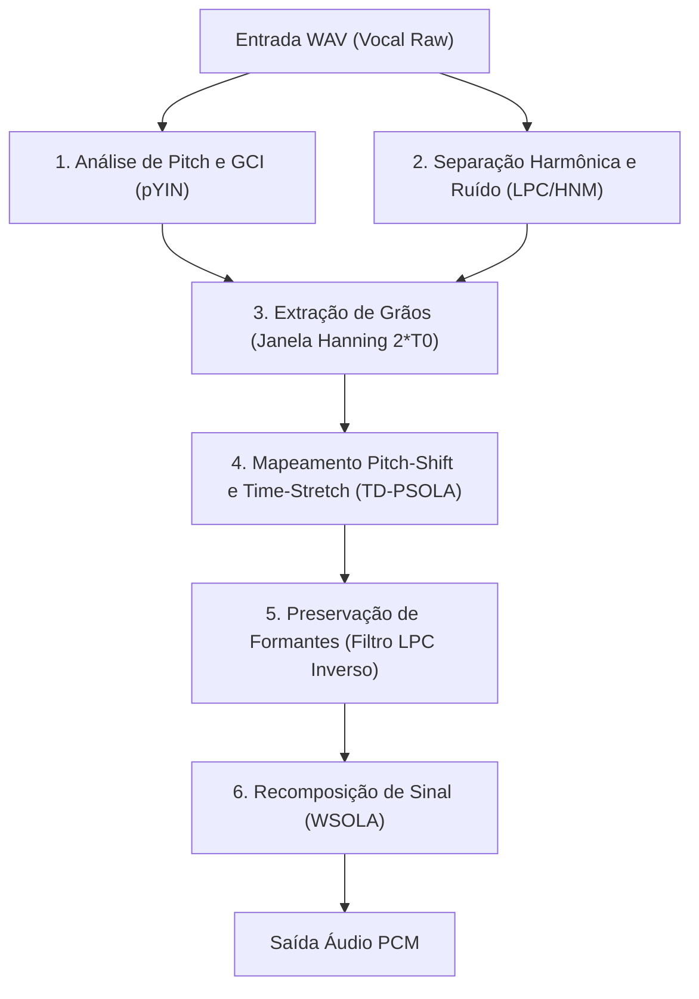

# Especificação Técnica de Melhorias no Sintetizador TD-PSOLA (Kamafeu)

O algoritmo TD-PSOLA (Time-Domain Pitch-Synchronous Overlap-Add) é responsável pelo processamento de afinação e tempo em sintetizadores de voz baseados em amostras.

Este documento detalha as limitações conhecidas do motor atual do Kamafeu e define o plano de desenvolvimento técnico para o módulo DSP.

## 1. Comparativo de Arquitetura

| Recurso | Implementação Atual | Proposta | Objetivo Técnico |
| :--- | :--- | :--- | :--- |
| Detecção de Pitch ($F_0$) | Autocorrelação estática em janela única | Algoritmo pYIN por frame | Reduzir erros de oitava e falhas na estimativa de afinação |
| Marcadores de Época (GCI) | Posição fixa de amostras | GCI (Glottal Closure Instants) alinhado aos picos de energia | Evitar cancelamento de fase e artefatos de sobreposição |
| Preservação de Formantes | Sem correção | Envelope LPC com inversão de filtro | Manter o timbre original em deslocamentos de pitch |
| Tratamento de Consoantes | Cópia estática baseada em `consonant_ms` | WSOLA em trechos não-sonoros | Manter ruídos fricativos sem repetição de grãos |
| Componente de Ruído | Processamento uniforme | Separação no modelo HNM | Permitir ajuste de ruído e sopro (parâmetro $B$) |
| Interpolação de Pitch | Linear por segmento | Hermite Cubic Spline | Suavizar transições de portamento e vibrato |
| Processamento em Bloco | Laço escalar simples | Vetorização com SIMD (AVX2 e NEON) | Aumentar a taxa de processamento na CPU |

## 2. Detalhamento dos Módulos



### Melhoria 1: Detecção de Época Glotal (GCI)
O algoritmo atual divide o sinal em intervalos regulares a partir de uma estimativa estática. Caso o centro da janela de sobreposição não coincida com os pulsos glotais, ocorre cancelamento de fase na soma dos grãos.

Solução:
* Implementar o detector GCI baseado em derivadas de autocorrelação e pontos de inflexão no sinal.
* Alinhar a janela Hanning de duração $2 \cdot T_0(t)$ exatamente nos momentos de fechamento glotal ($t_{gci}$).

### Melhoria 2: Preservação de Formantes com LPC
Ao reduzir a distância entre grãos para elevar a afinação, o espectro do sinal é deslocado proporcionalmente, alterando as frequências de ressonância do trato vocal.

Solução:
* Calcular o envelope espectral via LPC de ordem $p \approx \frac{F_s}{1000} + 2$.
* Aplicar a filtragem inversa $A(z)$ para obter o sinal residual glotal.
* Aplicar o deslocamento de pitch sobre o sinal residual.
* Filtrar o sinal resultante pelo filtro de síntese $1 / A(z)$ ajustado com a resposta de frequência original.

$$\hat{S}(e^{j\omega}) = E_{shifted}(e^{j\omega}) \cdot H_{original}(e^{j\omega})$$

### Melhoria 3: Processamento WSOLA em Trechos Surdos (Unvoiced)
Sinais fricativos e consoantes surdas ($s$, $t$, $k$, $f$) possuem espectro contínuo de ruído. O PSOLA convencional introduz periodicidade artificial nestes segmentos.

Solução:
* Classificar os quadros entre sonoros e não-sonoros (V/UV) por taxa de cruzamento por zero (ZCR) e distribuição de energia.
* Aplicar o algoritmo WSOLA (Waveform Similarity Overlap-Add) nas regiões não-sonoras, buscando a máxima correlação cruzada no domínio do tempo para preservar o ruído.

### Melhoria 4: Interpolação por Spline Cúbica de Hermite
A interpolação linear entre pontos de controle de pitch gera descontinuidades de derivada nos nós da curva.

Solução:
* Utilizar a interpolação Hermite Cubic Spline para a função $F_0(t)$ a partir dos pontos `UPitchBendPoint`.
* Garantir continuidade de primeira ordem na curva de frequência.

### Melhoria 5: Vetorização com Instruções SIMD
O laço de janelamento e soma de grãos é executado sequencialmente por amostra.

Solução:
* Estruturar os laços de multiplicação e acúmulo para uso das extensões AVX2 (x86_64) e NEON (ARM64).
* Processar blocos de amostras `f32` simultaneamente na memória.

```rust
#[cfg(target_arch = "aarch64")]
use std::arch::aarch64::*;

pub unsafe fn overlap_add_simd_neon(target: &mut [f32], grain: &[f32], window: &[f32]) {
    let len = grain.len().min(window.len()).min(target.len());
    let mut i = 0;
    while i + 4 <= len {
        let v_target = vld1q_f32(target.as_ptr().add(i));
        let v_grain = vld1q_f32(grain.as_ptr().add(i));
        let v_win = vld1q_f32(window.as_ptr().add(i));
        
        let v_res = vfmaq_f32(v_target, v_grain, v_win);
        vst1q_f32(target.as_mut_ptr().add(i), v_res);
        i += 4;
    }
    while i < len {
        target[i] += grain[i] * window[i];
        i += 1;
    }
}
```

## 3. Etapas de Implementação

1. Módulo de análise pYIN e detecção de GCI em `src/dsp/pyin.rs`.
2. Filtro LPC e algoritmo Levinson-Durbin em `src/dsp/lpc.rs`.
3. Classificação V/UV e integração WSOLA em `src/dsp/sola.rs`.
4. Vetorização SIMD das rotinas de janelamento em `src/dsp/resampler.rs`.
